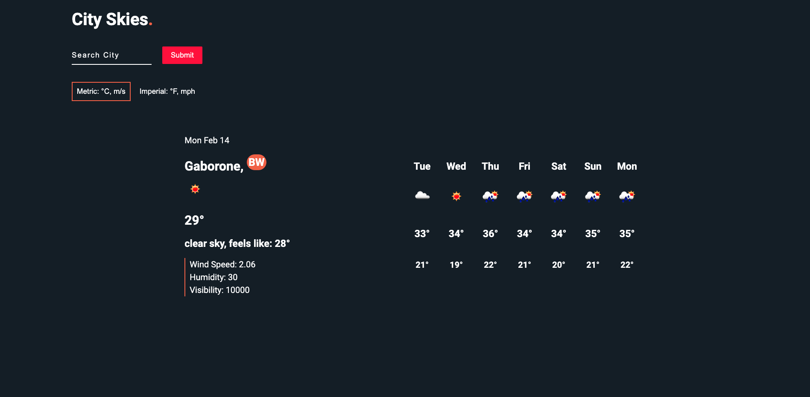

# City Skies
> A weather forecast web app displaying the current and weekly forecast with reverse geocoding and a city search.
> Live demo [_here_](https://atrp87.github.io/City_Skies/).

## Table of Contents
* [General Info](#general-information)
* [Technologies Used](#technologies-used)
* [Lessons Learned](#Lessons-learned)
* [Screenshots](#screenshots)
* [Acknowledgements](#acknowledgements)
* [Contact](#contact)

## General Information
- The project allowed me to try out async / await previously I had only been promise chaining with .then handlers.
- More time investigating the JavaScript Event Loop, Call Stack, Callback Queue and Microtask Queue
- Manual error handling 

## Technologies Used
- [Javascript](https://www.javascript.com/)
- CSS

## Lessons Learned
- 404 error doesn’t reject the promise (surprisingly) it's considered a successful request from the promise point of view.
- Microtask Queue has higher priority than Callback Queue of fetching the callback functions to Event Loop.
- Although  I didn’t use any promise combinators I was able to take my time and look in to running promises parallel and other promise combinators specifically all and race.

## Screenshots

## Acknowledgements
Built using [OpenWeather API](https://openweathermap.org/) and [LocationIQ](https://locationiq.com/)

## Contact
Created by [drewpeattie@hotmail.com](mailto:drewpeattie@hotmail.com) - feel free to contact me!
