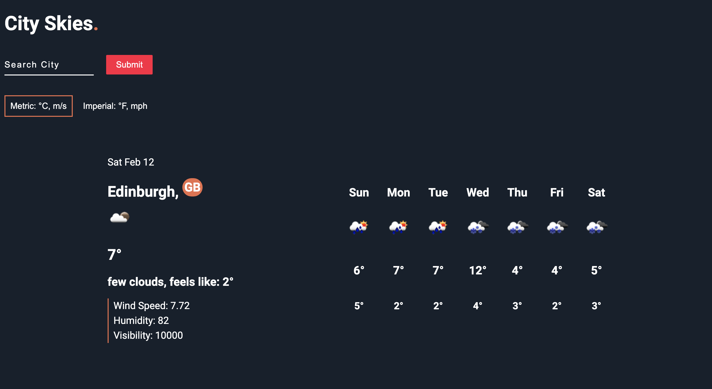

# City Skies
> React music player with play / pause, skip forward / back and a drag handler to change the position of the song with a library of songs from chillhop.com.
> Live demo [_here_](https://chillhop-phi.vercel.app/).

## Table of Contents
* [General Info](#general-information)
* [Technologies Used](#technologies-used)
* [Lessons Learned](#Lessons-learned)
* [Screenshots](#screenshots)
* [Acknowledgements](#acknowledgements)
* [Contact](#contact)

## General Information
- This allowed me to consolidate core concepts and refresh working with hooks ( more time spent on class components ) before looking into state management ( Redux ).
- This was also my fist real experience with Scss, I have a lot of appreciation for CSS as it seems like this never ending language where there is always something knew to learn.
- Scss is a great addition as it’s very intuitive with nesting, variables and partials, I will definitely be using it in the future.

## Technologies Used
- [Javascript](https://www.javascript.com/)
- CSS

## Lessons Learned
- Passing, deconstructing and drilling props
- Modifying, passing and lifting state
- Working with hooks such as useRef for capturing input values and useState

## Screenshots

## Acknowledgements
Built using [OpenWeather API](https://openweathermap.org/) and [LocationIQ](https://locationiq.com/)

## Contact
Created by [drewpeattie@hotmail.com](mailto:drewpeattie@hotmail.com) - feel free to contact me!
